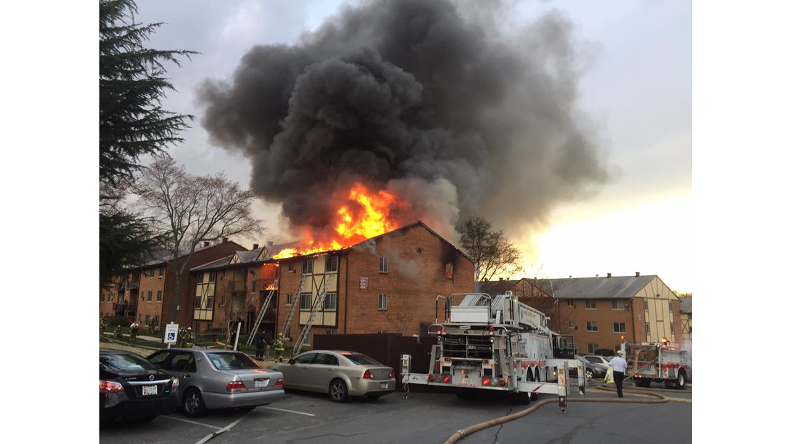
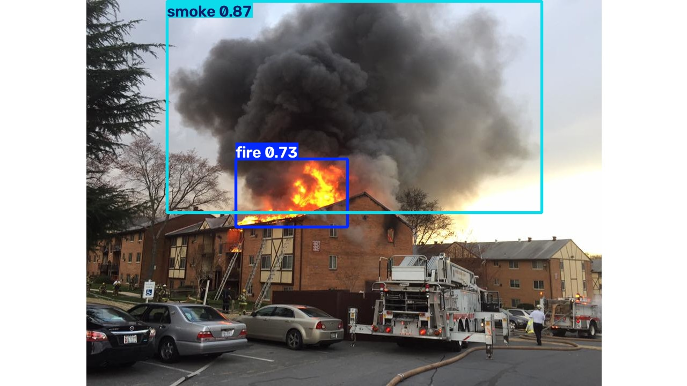
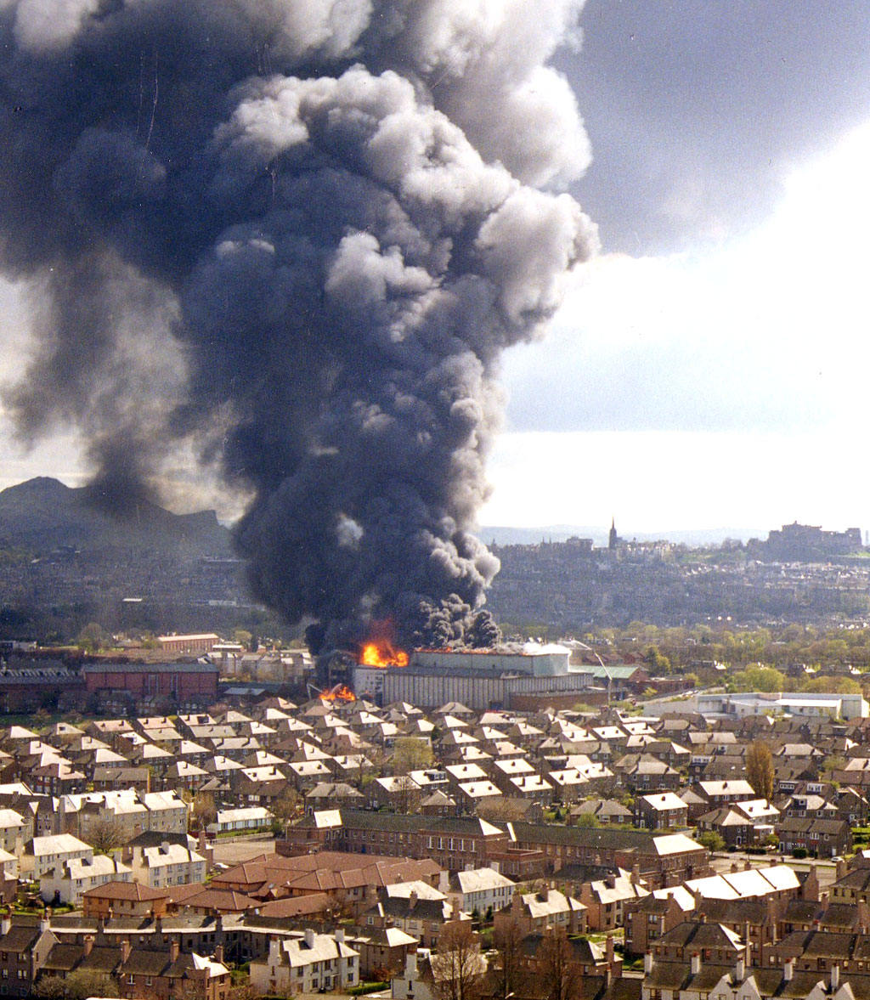
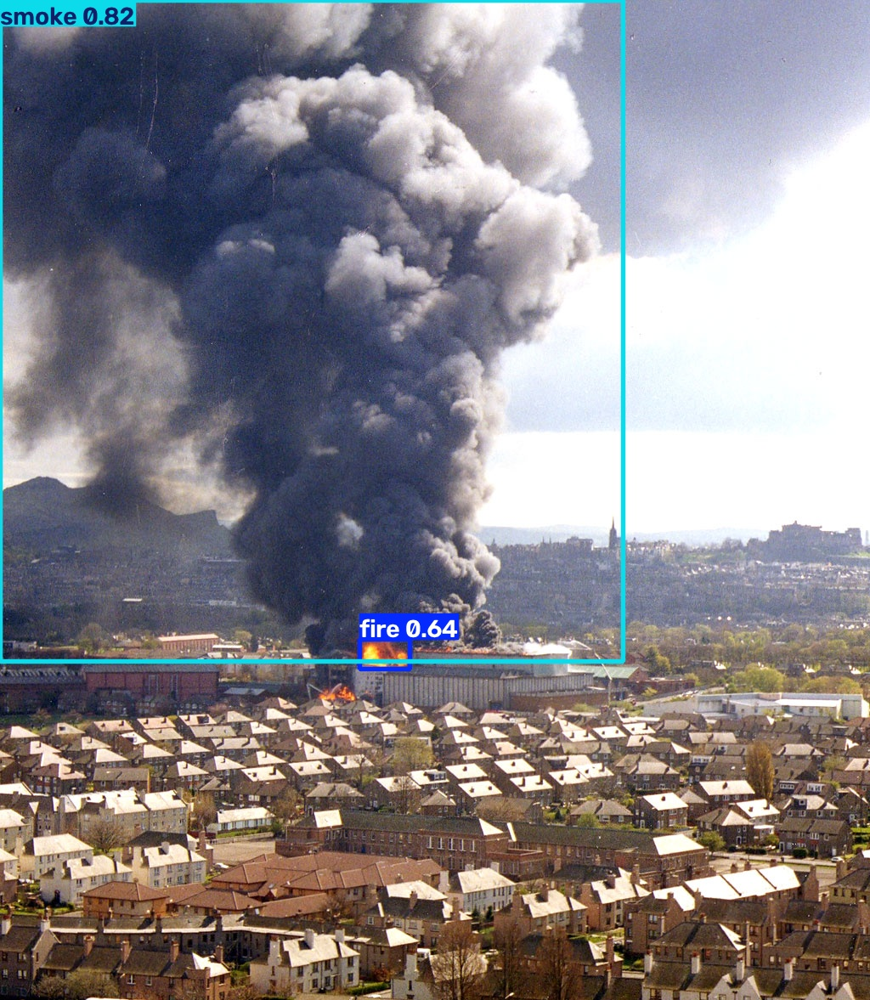

# Computer Vision

## Fire and Smoke Project

Research of fire and smoke detection at the Computer Vision Laboratory of the Federal University of Santa Catarina (UFSC).

## Detections

### YOLO

>model: yolo26n.pt | best map50 (box): 0.772 | dataset: fasdd_cv [article 1] [total:95k, fire(only):12.5k, smoke(only):23.3k, fire+smoke:20.1k, null:39.1k]

| Original | Output |
| --- | --- |
|  |  |
|  |  |

### RT-DETR

>model: rtdetr | epochs: 40 | gpu: rtx 5090 | platform: jetson orin


## Articles

"An open flame and smoke detection dataset for deep learning in remote sensing based fire detection"

>[document](articles/An%20open%20flame%20and%20smoke%20detection%20dataset%20for%20deep%20learning%20in%20remote%20sensing%20based%20fire%20detection.pdf), [dataset](https://www.scidb.cn/en/detail?dataSetId=ce9c9400b44148e1b0a749f5c3eb0bda)

Zoe Depth

>[document](articles/zoe_depth.pdf)

## Notes

> Use reliable datasets from articles with a balanced number of classes for fire, smoke and null images.

> Improve training with augmentations, parameters, and null-imgs.

> SAM3 / NVIDIA LocateAnything auto-label annotations are causing problems and false metrics.

**Dependencies**: uv, ultralytics yolo, google colab, tensorflow, opencv

**Datasets**: [roboflow](https://roboflow.com/), [open images v7](https://storage.googleapis.com/openimages/web/index.html), [aws open data](https://registry.opendata.aws/), [huggingface](https://huggingface.co/datasets)

**Annotations**: [CVAT](https://app.cvat.ai), roboflow

## Scripts

### Convert pytorch models inside Jetson 

```bash
# Convert pytorch models on Jetson
yolo export model=models/fire_yolo26n.pt format=engine half=True
yolo export model=models/fire_rtdetr.pt format=engine half=True
```

### Save model and dataset

>model: https://huggingface.co/seawsurf/fire_rtdetr

>dataset: https://huggingface.co/datasets/seawsurf/fire_smoke_dataset_fasdd_cv

```python
# uv venv
# uv pip install huggingface_hub
# uv run main.py
from huggingface_hub import login, upload_file, upload_folder

# Login
login()

# Push dataset
"""
upload_file(
    path_or_fileobj="FASDD_CV.zip",      # Your local file path
    path_in_repo="FASDD_CV.zip",         # The name the file will have on the Hub
    repo_id="seawsurf/fasdd_cv",      # Your target repository
    repo_type="dataset"                  # Flagging it as a dataset repo
)
"""

# Push model
upload_folder(
    folder_path="fire_smoke_box", 
    repo_id="seawsurf/fire_smoke_box", 
    repo_type="model"
)
```

### Convert videos to gif
```bash
FOR %a IN (*.mp4 *.avi) DO ffmpeg -i "video.mp4 or %a" -f segment -segment_time 25 -vf "fps=25,scale='min(720,iw)':-1:flags=lanczos" -loop 0 "%~na_%00d.gif
```

---

## Structure
| Folder |  Description |
| --- | --- |
| models/ | trained models for fire and smoke detection |